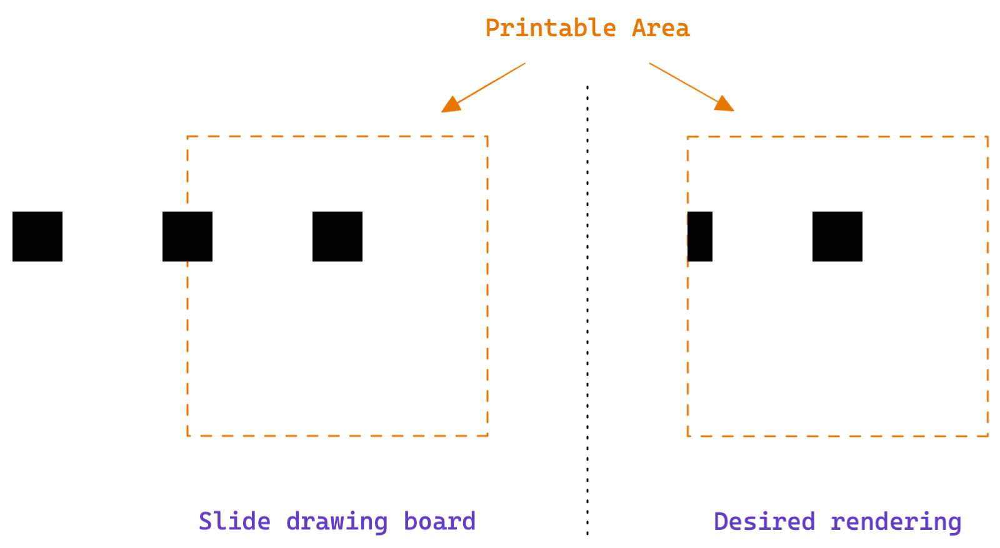
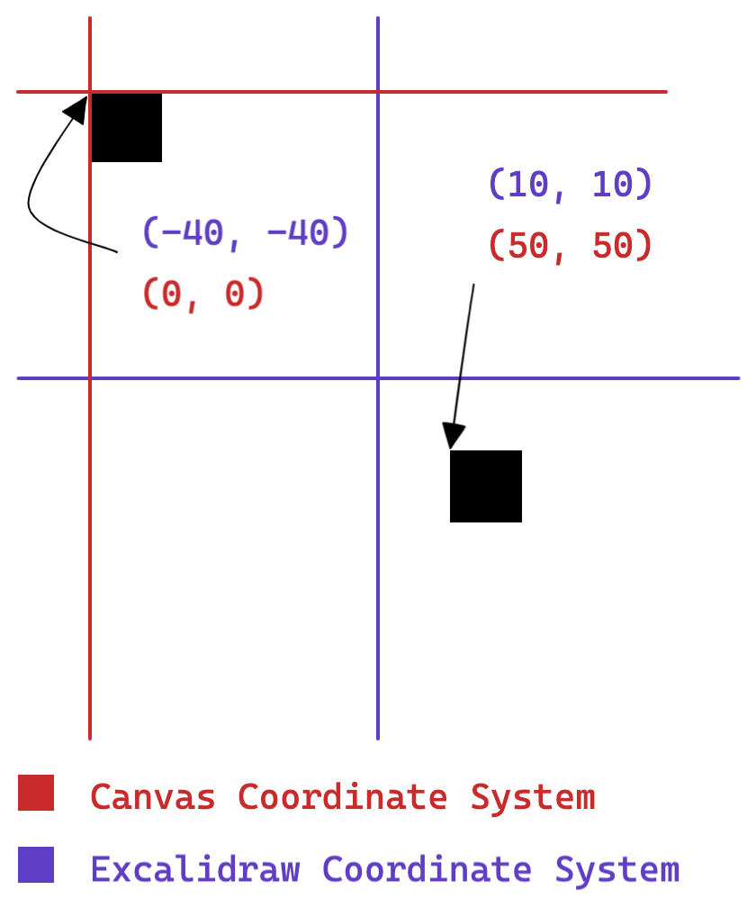
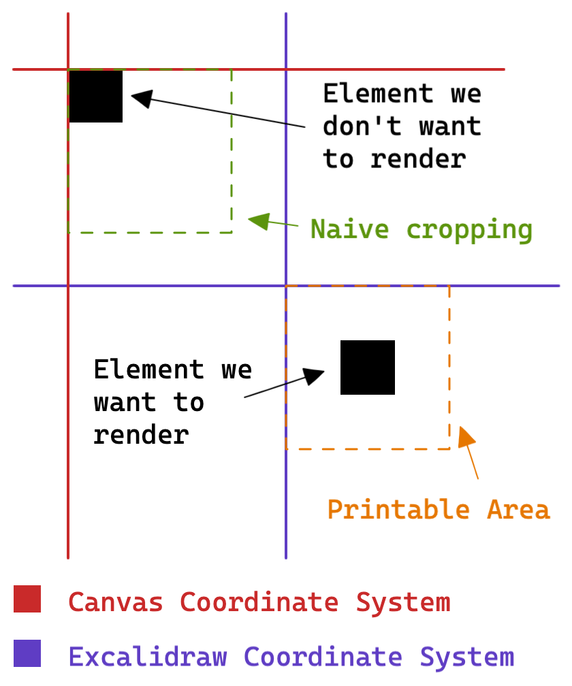
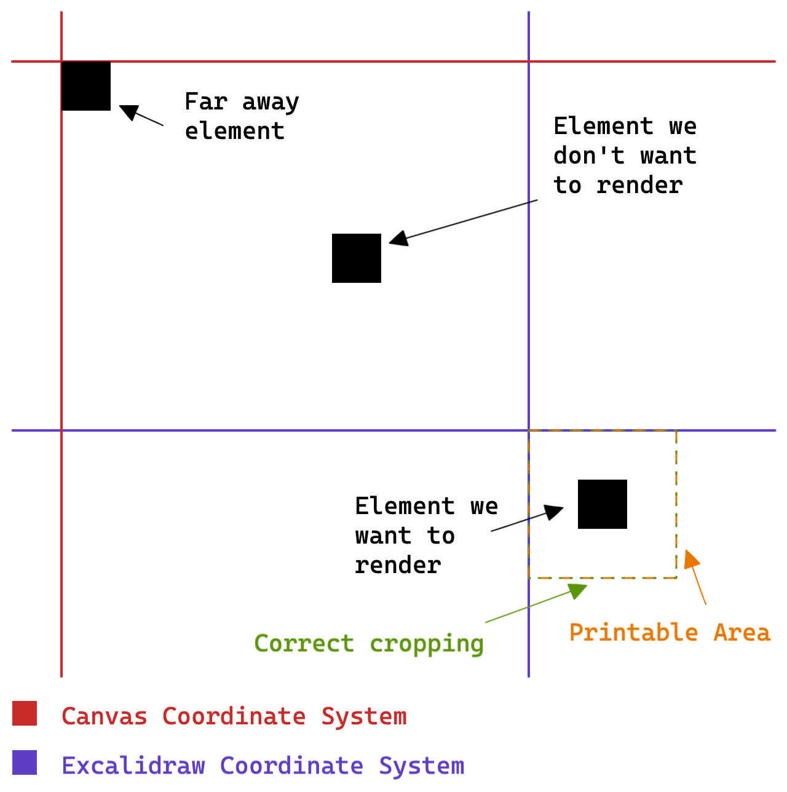

# How `canvasSlideRenderer` works

## Goal

When rendering a slide, we want to render only the Excalidraw elements lying
inside the printable area of the slide. For elements lying partially inside and
partially outside of the printable area, we only want to render the portion
inside the printable area.

## Approach

First, render all Excalidraw elements to a canvas. Then, crop the canvas to the
printable area.

### Difficulty

The main difficulty with this approach is identifying **where** the printable
area is located inside the canvas. This is because Excalidraw's `exportToCanvas`
function produces a canvas with a coordinate system where `(0, 0)` is assigned
to the top-left-most point of the set of rendered Excalidraw elements.

So, given that the printable area is set to have Excalidraw-coordinates
`(0, 0, printableArea.width, printableArea.height)`, naively cropping the canvas
to those same coordinates wouldn't produce the desired effect.

### Solution

The chosen way to overcome this difficulty is to add a "far away" Excalidraw
element, a rectangle whose top-left-most point is _most likely_ above and
more-to-the-left-than any other element. Knowing the Excalidraw-coordinates of
the top-left-most point of this rectangle, and knowing that said point will
_most likely_ have canvas-coordinates `(0,0)`, we can then figure out the
correct cropping area.

### Notes

- when calling `CanvasRenderingContext2D.drawImage` in webkit browsers, if we
  pass cropping coordinates that exceed the bounds of the source canvas (in our
  case the canvas returned by Excalidraw's `exportToCanvas`), we get unexpected
  results ([read some details](https://stackoverflow.com/q/35500999)). To avoid
  this, we set height and width of the "far away" rectangle so that it
  encompasses the whole printable area, hence guaranteeing that the cropping
  coordinates won't exceed the bounds of canvas returned by Excalidraw's
  `exportToCanvas`
- Excalidraw's `exportToCanvas` function adds some padding around the scene, so
  that needs to be taken into account when cropping
